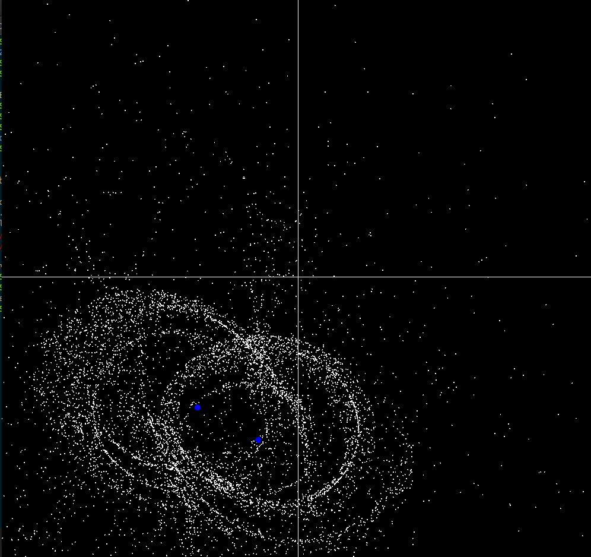

## Introduction

This repository contains my course project `Galaxy-Merger Simulation` of `CS293` course `Data Structures and Algorithms Laboratory`  done under prof. `Bhaskaran Raman` in our third semester at IIT Bombay. This simulation have been implemented in two different graphics library `SimpleCpp` and `SFML`. Two different algorithms with respective running time complexity $\mathcal{O}(n^2)$  and $\mathcal{O}(nlog(n))$ has been implemented.

## Approach

To solve this problem we started with a known initial distribution of the bodies and known velocities and accelerations. From the initial conditions the system can be advanced in time by using numerical computations and a suitable integration scheme. 

The equation for computing the force caused by number of particles on a single particle can be computed by the law of gravity: 

### N![(/home/utkarsh/Documents/iitb/cs293/project/galaxy/galaxy.png)aive Approach

I have Implemented a naive algorithm in the **Simplecpp** graphics library. Lets assume Fij is the force acting between particles i and  j. The total number of force calculations required to compute the state  of the system is N*(N-1). So the problem is of order O(N^2).

## The Barnes-Hut Algorithm

* The crux of the Barnes Hut scheme is to approximate the effect of "far  away" bodies but calculate exactly the forces attributed to "near"  bodies. To do this a **QuadTree** data structure is used. 

* The space is partitioned into 4 equal squares at depth 1  \- at depth 2 each of these squares is then partitioned into 4 equal squares and so on.  From this a tree is constructed with each node representing the number of bodies within the quadrant at that depth. This is repeated recursively until a depth is reached where each quadrant has 1 or 0 bodies in it. 

* For each quadrant in the quadtree we can calculate a centre of mass (in  the obvious way). Then given a body we can calculate the force acting on it from a given quadrant by applying the Newtonian force calculation  using the centre of mass. We could, for example, apply this to the 4  quadrants at depth 1 to approximate the force acting on the body.  

* The Barnes Hut algorithm specifies a critical distance θθ if the distance between the body and the centre of mass of the quadrant is greater than θθ then it is used as an approximation, if not the algorithm moves to the  next depth of the quadtree and tries again, this happens recursively  until the distance becomes below θθ or there is only 1 body in the quadrant 

  

**It has a time complexity of Nlog(N)**

## Results

### [Link to Demo Video](https://drive.google.com/file/d/1TMJ-ny1K-zSIebrjW1ESVEEKc1jqBJG2/view?usp=sharing) 

